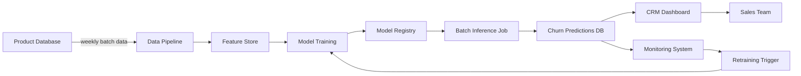

# Weekly Churn Prediction Architecture

```mermaid
flowchart LR

A[Product Database] -->|weekly batch data| B[Data Pipeline]

B --> C[Feature Store]

C --> D[Model Training]

D --> E[Model Registry]

E --> F[Batch Inference Job]

F --> G[Churn Predictions DB]

G --> H[CRM Dashboard]

H --> I[Sales Team]

G --> J[Monitoring System]

J --> K[Retraining Trigger]

K --> D
```
